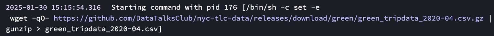
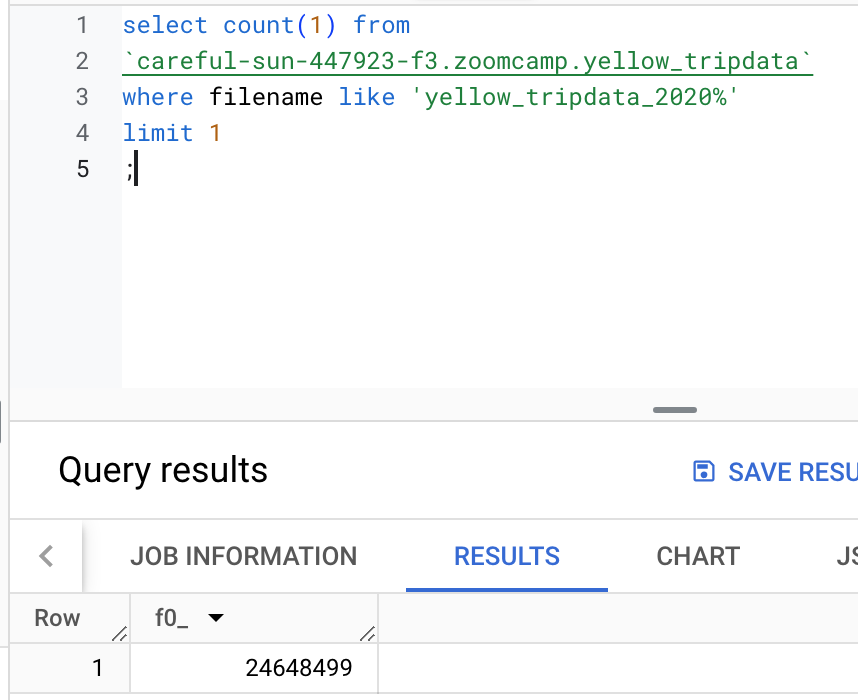
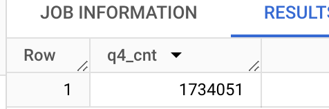
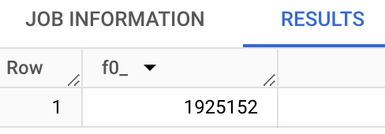

## Module 2 Homework

### Quiz Questions & Answers

Complete the Quiz shown below. It’s a set of 6 multiple-choice questions to test your understanding of workflow orchestration, Kestra and ETL pipelines for data lakes and warehouses.

1. Within the execution for `Yellow` Taxi data for the year `2020` and month `12`: what is the uncompressed file size (i.e. the output file `yellow_tripdata_2020-12.csv` of the `extract` task)?

- 128.3 MB
- 134.5 MB
- 364.7 MB
- 692.6 MB


The answer is 128.3 MB.

2. What is the rendered value of the variable `file` when the inputs `taxi` is set to `green`, `year` is set to `2020`, and `month` is set to `04` during execution?

- `{{inputs.taxi}}_tripdata_{{inputs.year}}-{{inputs.month}}.csv`
- `green_tripdata_2020-04.csv`
- `green_tripdata_04_2020.csv`
- `green_tripdata_2020.csv`



3. How many rows are there for the `Yellow` Taxi data for all CSV files in the year 2020?

- 13,537.299
- 24,648,499
- 18,324,219
- 29,430,127

```bash
select count(1) from
`careful-sun-447923-f3.zoomcamp.yellow_tripdata`
where filename like 'yellow_tripdata_2020%'
limit 1
;
```

result:


4. How many rows are there for the `Green` Taxi data for all CSV files in the year 2020?

- 5,327,301
- 936,199
- 1,734,051
- 1,342,034

```bash
select count(1) from
`careful-sun-447923-f3.zoomcamp.green_tripdata`
where filename like 'green_tripdata_2020%'
limit 1
;
```

result:



5. How many rows are there for the `Yellow` Taxi data for the March 2021 CSV file?

- 1,428,092
- 706,911
- 1,925,152
- 2,561,031

I added '2021' to the yaml and executated the work.
result:


6. How would you configure the timezone to New York in a Schedule trigger?

- Add a `timezone` property set to `EST` in the `Schedule` trigger configuration
- Add a `timezone` property set to `America/New_York` in the `Schedule` trigger configuration
- Add a `timezone` property set to `UTC-5` in the `Schedule` trigger configuration
- Add a `location` property set to `New_York` in the `Schedule` trigger configuration

I chose 'Add a timezone property set to America/New_York in the Schedule trigger configuration'.
